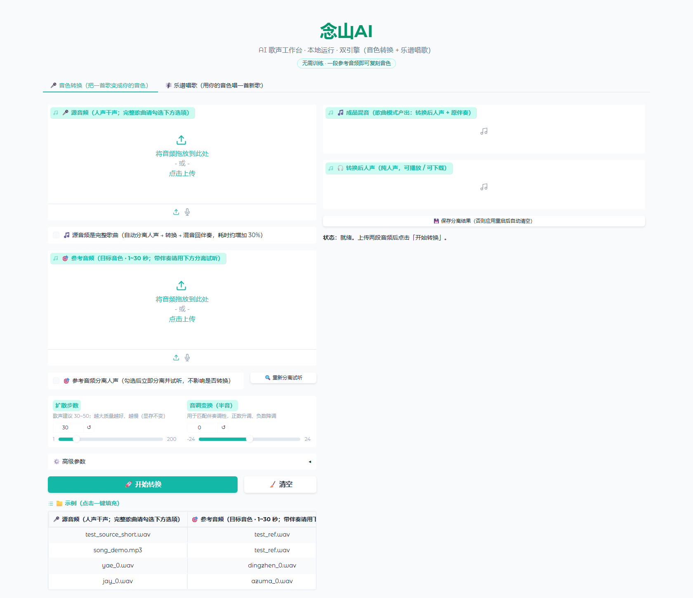

# Nianshan AI (念山AI)

**A local AI singing workbench** — dual engine, fully offline, audio never leaves your machine.

[中文文档](README.md) | **English**

| Engine | Capability | In one line |
|---|---|---|
| **Voice Conversion** (Seed-VC) | Turn a song or vocal into any target timbre | Zero-shot: a 10-second reference is enough, **no training** |
| **Score-to-Singing** (YingMusic-Singer) | MIDI score + lyrics + timbre → a new song | Zero-shot singing synthesis, **no existing vocal needed** |

Both support **full songs**: automatic vocal/accompaniment separation → conversion → remix, producing a finished track.



> ⚠️ **For personal study and research only.** Voice is protected as a personality right under Article 1023 of China's Civil Code — do not clone voices you are not authorized to use. See [License & Compliance](#license--compliance).

---

## Features

### 🎤 Voice Conversion
- Zero-shot timbre cloning from a 10–30 s reference — no training required
- **Full-song mode**: automatic Demucs separation → conversion → remix
- **Reference separation**: when your reference contains backing music, separate the dry vocal on the fly (instant preview on toggle)
- **Preview & save-on-demand**: separated stems go to a temp folder by default; save them only if you want to keep them
- Live progress: elapsed time, estimated total, per-chunk progress

### 🎼 Score-to-Singing
- Input **MIDI score + lyrics + 5–7 s timbre audio** → sung output
- **Breaks the single-pass duration cap**: automatic chunking at phrase boundaries with sample-accurate stitching, so full songs work
- **VRAM arbitration** with voice conversion: models are loaded/unloaded automatically when you switch modes

---

## Requirements

| Item | Requirement | Notes |
|---|---|---|
| OS | **Windows 10/11** | Only verified on Windows so far |
| GPU | **NVIDIA, ≥ 4 GB VRAM** | 4 GB works (see benchmarks below) |
| Recommended VRAM | 8 GB for comfort | At 4 GB the driver's sysmem fallback is used, which is noticeably slower |
| Disk | **~20 GB** | Two environments + weights + ffmpeg |
| Python | Prepared by the installer | Needs `uv` or `python` 3.10+ |
| Network | Able to reach ModelScope | Weights download from ModelScope |

> **Not recommended without an NVIDIA GPU**: CPU inference is roughly 20–50× slower — a 4-minute song could take hours.

---

## Installation

```powershell
git clone https://github.com/J-0201/nianshan-ai.git
cd nianshan-ai
.\install.ps1
```

`install.ps1` performs the following automatically:

1. Clones upstream projects (**pinned to verified commits**)
2. Creates two isolated Python environments and installs dependencies
3. Applies this project's patches (Windows compatibility)
4. Downloads model weights (ModelScope) and ffmpeg
5. Deploys this project's files into place

Expect 20–60 minutes (about 10 GB of downloads).

**Custom layout**: upstreams are cloned as **siblings** of this repo by default. If you already have them elsewhere, override with environment variables:

| Variable | Meaning |
|---|---|
| `NS_SEEDVC_DIR` | Seed-VC directory |
| `NS_SVS_DIR` | YingMusic-Singer directory |
| `NS_FFMPEG_DIR` | Directory containing `ffmpeg.exe` |
| `NS_DEMO_AUDIO_DIR` | Directory with example audio |

---

## Usage

```powershell
# Double-click, or run in PowerShell
.\启动念山AI.bat
```

The browser opens automatically at <http://127.0.0.1:7860/>

You can also bypass the `.bat`:

```powershell
cd seed-vc
.\run_webapp.ps1
```

To stop: close the console window, or double-click `停止念山AI.bat`.

### Key parameters

| Parameter | Recommendation |
|---|---|
| Diffusion steps | **30–50**. Measured: steps affect **audio quality and speed, not timbre similarity** |
| Auto F0 adjust | **Must stay OFF** for singing. Enabling it transposes the source pitch and breaks key agreement with the accompaniment |
| Full song | Enable when the source has backing music; separation + remix run automatically |
| Pitch shift (score-to-singing) | Default **-1**. Large shifts measurably degrade quality; stay within roughly -3 to +2 |

---

## Benchmarks

All figures measured on the author's machine: **RTX 3050 Laptop, 4 GB VRAM**.

### Voice conversion

| Scenario | Time | Peak VRAM |
|---|---|---|
| 8 s audio, 30 steps | 10.5 s | 2386 MiB |
| 20.8 s audio, 30 steps | ~60 s (RTF 1.69) | 3907 MiB |
| 4-minute song (separate + convert + remix) | ~10.5 min | ~3.9 GB |

### Effect of diffusion steps on timbre similarity

Timbre similarity measured with Seed-VC's own CAM++ speaker model:

| Steps | Time | Timbre similarity | HF energy (8 kHz+) |
|---|---|---|---|
| 8 | 6.1 s | 0.6328 | 3.58% (noisy) |
| 15 | 6.2 s | 0.6645 | 3.75% (noisy) |
| 30 | 8.2 s | 0.6234 | 1.90% |
| 50 | 12.4 s | 0.6611 | 2.16% |
| 80 | 16.8 s | 0.6668 | **1.73% (≈ reference)** |

**Conclusion: more steps do not make the voice more similar — they only reduce high-frequency artifacts.** Real levers for similarity are reference audio quality and training data, not step count.

### Score-to-singing

| Scenario | Result |
|---|---|
| 28 s score, NFE 32 | 50.3 s, RTF 1.80 |
| **111 s score (4 chunks stitched)** | 198.8 s, peak 3910 MiB |
| Pitch tracking vs. score | Contour correlation 0.868 (residual 1.79 semitones) |
| **Max discontinuity within ±5 ms of a seam** | **0.0000 (perfectly seamless)** |
| Single-pass limit | 40 s works, 55 s OOMs |

---

## Project structure

```
nianshan-ai/
├── install.ps1              One-click deployment
├── app/                     Voice-conversion application layer
│   ├── app_nianshan.py        Main UI (Gradio)
│   ├── run_webapp.ps1         Launcher (env vars, caches, port)
│   ├── svc_launch.py          CLI launcher
│   └── app_launch.py          Official UI launcher (for comparison)
├── svs/                     Score-to-singing
│   ├── long_song.py           Chunked generation + seamless stitching
│   ├── svs_runner.py          Subprocess runner (JSON protocol)
│   └── verify_melody.py       Objective pitch verification
├── patches/                 Required upstream changes (as patches — no upstream code vendored)
├── tools/                   Development-time verification scripts
└── docs/
    ├── 音色转换方案.md        Deployment, pitfalls, VRAM and quality measurements (Chinese)
    └── 乐谱歌声合成方案.md     Duration limits, chunk stitching, key findings, architecture (Chinese)
```

**This repository contains neither upstream code nor model weights** — both are fetched from their original sources by `install.ps1`.

---

## Known limitations

1. **4 GB VRAM is very tight.** Score-to-singing exceeds physical VRAM and relies on the NVIDIA driver's sysmem fallback to finish, at the cost of speed. In that state it **must not run alongside other VRAM-hungry applications**.
2. **The two engines cannot be resident simultaneously.** The app handles loading/unloading automatically, but switching modes incurs a ~20 s model load.
3. **Single-pass score-to-singing is capped around 40–160 s** depending on VRAM; longer songs use chunked stitching.
4. **Windows only.** macOS (Apple Silicon MPS) and Linux are untested.
5. **Quality is bounded by the reference audio**: clean, accompaniment-free, 5–30 s works best.

---

## License & Compliance

### This repository

**GPL-3.0.** This project depends on and invokes [Seed-VC](https://github.com/Plachtaa/seed-vc) (GPL-3.0); under GPL's copyleft, the combined work must be released under the same license.

### Third-party components (each verified individually)

| Component | Code license | Weights license |
|---|---|---|
| Plachtaa/seed-vc | GPL-3.0 | GPL-3.0 |
| GiantAILab/YingMusic-Singer | README claims MIT (no LICENSE file in repo) | ⚠️ **CC-BY-NC-4.0 (non-commercial)** |
| nvidia/bigvgan | MIT | MIT |
| funasr/campplus | Apache-2.0 | Apache-2.0 |
| openai/whisper-small | MIT | Apache-2.0 |
| lj1995/VoiceConversionWebUI (RMVPE) | — | MIT |
| facebookresearch/demucs | MIT | Not declared on the model card |

⚠️ **The two findings that matter most:**

1. **YingMusic-Singer's weights are CC-BY-NC-4.0 — commercial use is prohibited**, despite the repository README claiming MIT.
2. **Seed-VC's code and weights are both GPL-3.0**, which rules out closed-source commercial distribution.

**Therefore: unlimited for personal use; commercial use requires resolving the licensing above first.**

### Compliance notes

- Voice is protected as a personality right under Article 1023 of China's Civil Code; cloning someone's voice requires **explicit authorization**.
- Providing generative-AI services to the public in mainland China requires **algorithm filing and a security assessment**; deep-synthesis content additionally requires **labeling**.
- Prefer **your own voice, licensed material, or synthetic voices**.

---

## Acknowledgements

- [Seed-VC](https://github.com/Plachtaa/seed-vc) — zero-shot voice conversion engine
- [YingMusic-Singer](https://github.com/GiantAILab/YingMusic-Singer) — zero-shot singing voice synthesis
- [Demucs](https://github.com/facebookresearch/demucs) — vocal/accompaniment separation
- [BigVGAN](https://github.com/NVIDIA/BigVGAN), [CAM++](https://github.com/modelscope/FunASR), [RMVPE](https://github.com/Dream-High/RMVPE), [Whisper](https://github.com/openai/whisper), [Gradio](https://github.com/gradio-app/gradio)
